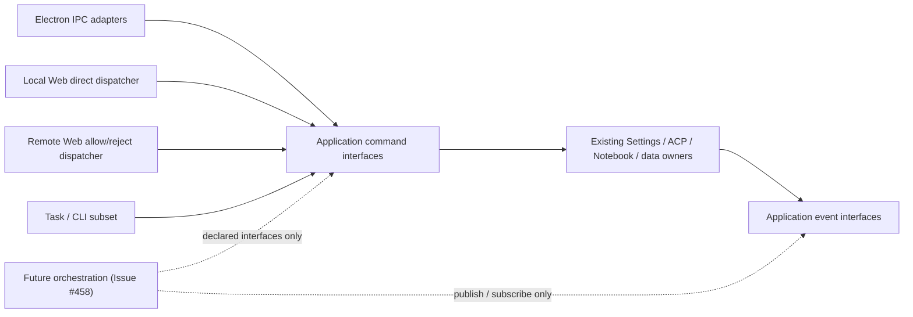

# Open-Science — Product Requirements Document

> Status: living document, describes the current product and its requirements. For available capabilities, remaining gaps, and uncommitted future directions, see [`ROADMAP.md`](ROADMAP.md). For the visual/interaction spec, see [`design.md`](design.md).

## 1. Summary

**Open-Science is an open-source, model-agnostic AI workbench for scientific discovery.** Its desktop-first workspace combines literature and evidence management, a planning-and-execution agent, persistent managed computation, and durable project/session storage — so a researcher can hand off a real data-analysis or literature task to an agent and get back not just an answer, but the code, execution record, and artifacts that produced it.

The project exists because the clearest current articulation of this product category is closed-source and single-vendor: gated by billing region, subscription tier, and one company's model and infrastructure choices. Open-Science is an independent, from-scratch implementation of the same category of tool — not a proxy, wrapper, or jailbreak of any existing closed product — built so labs can choose compatible models and infrastructure on their own terms.

## 2. Problem Statement

A working researcher's day is a tour of disconnected tools: a reference manager, a notebook kernel, an SSH session into a cluster, browser tabs for database web forms, a stats package, and a manuscript editor that knows nothing about any of the above. None of these tools share state. None of them remember what was done yesterday. Reproducing an analysis from three months ago is often harder than running it the first time.

This shows up as four structural pains:

1. **Results aren't reproducible.** Code, data, and environment are scattered across machines, tracked (if at all) by manual habit. Nobody can reliably answer "which script, which parameters, which dependency versions produced this exact figure?"
2. **Constant tool-switching.** A typical workflow bounces between a scripting language, a stats package, shell access to a cluster, and literature search — every switch loses context and forces manual data movement.
3. **Fragmented compute.** A laptop, a lab server, an HPC cluster, and cloud GPUs are all valid places to run a job, but choosing and coordinating between them is manual, and data gets shuttled around unnecessarily.
4. **Audit is an afterthought.** In regulated research settings, reconstructing "who generated what, with what code, at what time" usually means reading logs after the fact rather than relying on something the system tracked by default.

## 3. Goals

- Give a researcher an agent that can **plan, execute, and revise** multi-step analysis and research tasks, not just suggest code for a human to run.
- Make every artifact the agent produces **traceable back to the code, data, and environment** that generated it.
- Keep the system **model-agnostic and self-hostable** by design, so no single vendor's pricing, billing region, or infrastructure choices gate access to it.
- Keep a **desktop-first experience** while exposing the same local backend through the existing localhost Web UI, headless CLI, and Task SDK, with paired mobile browser access and explicit capability boundaries between surfaces.
- Be honest about maturity: this PRD documents what exists, what's partially built, and what's aspirational — see the [Roadmap](ROADMAP.md) for current capabilities, limits, and proposed work tracks.

## 4. Non-Goals

- **Not a real-time multi-user collaborative editor.** Team workflows happen through export/share/import, not simultaneous co-editing of one session.
- **Not a replacement for domain-expert judgment.** Statistical validity, batch-effect analysis, and data-leakage risk remain calls the researcher makes; the system reduces the cost of _executing_ and _recording_ work, not the cost of _judging_ it.
- **Not modeling research semantics.** The system's structured objects are computations and artifacts, not first-class "hypothesis / experiment / conclusion" entities.
- **Not a proxy, reskin, or unofficial client of any closed-source product.** Open-Science shares no code with any single vendor's client software.

## 5. Target Users

- **Individual researchers and small labs** running data-heavy analysis (genomics, proteomics, structural biology, cheminformatics, and beyond) who want an agent that can execute, not just chat.
- **Institutions that cannot use a cloud-hosted, subscription-gated product** — due to data residency, billing region, or data-handling policy (e.g. PHI, unpublished data) — and need to self-host on their own infrastructure.
- **Contributors and toolmakers** who want to extend the system with new connectors, kernels, or skills rather than being limited to a closed plugin marketplace.

## 6. Product Principles

These are the constraints the project treats as non-negotiable as it grows (see the [README](../README.md) for the product overview):

- **Access is a right, not a privilege.** No plan tier, billing-region allowlist, or approval queue stands between a researcher and the software.
- **Model-agnostic core.** The agent runtime should ultimately talk to LLMs through a pluggable gateway — Claude, GPT, Gemini, DeepSeek, Qwen, or a locally-hosted open-weight model are all first-class citizens, not a hardcoded dependency. Today's product has pluggable Claude Code, OpenCode, Codex, and CodeBuddy backends, while provider compatibility still depends on the selected backend's supported API protocols — see [§8](#8-current-architecture-what-is-actually-implemented).
- **Local-first, data-sovereign by default.** Self-hosting is the default deployment target, not an enterprise upsell.
- **Reproducibility is a system property, not a discipline.** Every artifact should eventually carry the code, environment, and data lineage that produced it, generated automatically rather than maintained by hand.
- **Skills should be plain files, not opaque plugins.** Versioned, human-readable, and forkable — auditable by the person trusting them with their analysis.
- **Human-in-the-loop by construction.** New data sources, compute budgets, and external credentials require explicit, scoped approval; autonomy is opt-in, never ambient.
- **Composability over monolith.** Small, swappable services (model gateway, skill runtime, compute broker, artifact renderer) instead of one inseparable black box.
- **Trust is verified, not assumed.** Where the system makes a claim, that claim's basis (citation, computation, statistical method) should be checkable — ideally by another agent, not just by the researcher re-deriving it by hand.

## 7. Core User Journeys

1. **Start a project, run an analysis.** A researcher creates a project, opens a session, and asks the agent to load data, run a script, and produce a figure. The agent plans steps, executes them in the notebook kernel, and reports back with the resulting artifact — all without the researcher hand-writing the glue code.
2. **Resume where you left off.** The researcher closes the app and comes back days later; the home page provides project and session navigation, and reopening a session restores its retained conversation branches and recorded execution history.
3. **Review what the agent did before trusting it.** Every tool call the agent makes is shown as a typed activity row (code diff, code block, web search, etc.), and higher-risk actions pause for explicit approval before running.
4. **Preview outputs without leaving the app.** Generated CSVs, images, PDFs, Office documents, HTML reports, FASTA files, JSON, Markdown, molecular structures/reactions, and Notebook history render natively in-app instead of requiring the researcher to open them in a separate tool.
5. **Organize work by project.** Multiple projects keep sessions, artifacts, and notebook workspaces isolated from each other, so a researcher running several concurrent lines of work doesn't have them bleed into one shared history.
6. **Read and screen evidence.** Import references and PDFs, organize collections, screen against inclusion/exclusion criteria with AI and manual decisions kept distinct, annotate documents, and bring source-linked evidence into a conversation.
7. **Check and transfer a research record.** Inspect artifact provenance, replay eligible versions and compare outputs, then export selected history and files as a `.science` package. An imported record opens a paused research replay on the right and a linked discussion on the left. The source remains read-only; a writable fork continues the copied experiment without changing its source.

## 8. Current Architecture (What Is Actually Implemented)

Open-Science today is an Electron + React + TypeScript desktop application built around four cooperating layers:

| Layer                      | Responsibility                                                            | Current implementation                                                                                                                                                                                                                          |
| -------------------------- | ------------------------------------------------------------------------- | ----------------------------------------------------------------------------------------------------------------------------------------------------------------------------------------------------------------------------------------------- |
| **Interface**              | Desktop shell and browser workspace                                       | Electron main/renderer split; React + TypeScript; shadcn/Radix design system (see [`design.md`](design.md))                                                                                                                                     |
| **Agent Harness**          | Plan → execute → reflect loop, tool-call visualization, permission gating | Agent runtime wrapped over the Agent Client Protocol (ACP), with Claude Code, OpenCode, Codex, and CodeBuddy selectable behind the same runtime; typed tool-activity rows; scoped permission gates; specialist profiles; and an opt-in reviewer |
| **Execution / Data Plane** | Managed code execution, artifact generation                               | Persistent Python, R, and REPL control-plane kernels plus session-scoped shell execution (`src/main/notebook/`) with durable, inspectable run history, app-managed environments, background execution, and SSH/Slurm targets                    |
| **Persistence**            | Project/session storage, artifact storage                                 | Prisma + SQLite for project and provenance metadata; per-project, per-file session storage on disk (`src/main/session-persistence/`); immutable artifact versions and evidence sidecars under app-managed storage (`src/main/artifacts/`)       |

### Runtime State Ownership and Surface Boundaries

The main process has one composition root (`src/main/ipc.ts`). It constructs state owners once,
installs transport adapters after ownership is established, and disposes modules in reverse order.
The transport-neutral application command router and application event hub expose capabilities; they
do not become alternate state stores.

| Owner boundary                  | State and lifecycle responsibility                                                                                                                                                                                                                                                                                                                                                                |
| ------------------------------- | ------------------------------------------------------------------------------------------------------------------------------------------------------------------------------------------------------------------------------------------------------------------------------------------------------------------------------------------------------------------------------------------------- |
| Settings modules                | Persist provider, runtime, skill, connector, appearance, and related configuration. Active provider/model/effort are defaults for new Sessions; changing those defaults does not mutate existing Sessions. Runtime consumers resolve fresh credentials/configuration when a generation starts; they do not retain Settings mutable state.                                                         |
| ACP runtime coordinator         | Own runtime generations and stable application Session identity across reconnect/reset. Each create/resume carries the Session's explicit framework/provider/model/effort target; compatible targets reuse a generation. A provider protocol Session id belongs to its generation and may be replaced; Codex fresh-session adoption, transcript replay, context reset, and cleanup remain intact. |
| ACP runtime and Session owners  | Own one generation's live processes, prompts, permissions, resources, and per-turn terminal results. Context-window aggregation stays with the context-usage tracker; terminal timestamp, token usage, and model-turn count stay with the completed prompt turn.                                                                                                                                  |
| Notebook runtime                | Own runtime discovery, Session binding decisions, execution, environment operations, and durable run history. It consumes enablement snapshots through the named Settings capability rather than owning or reading raw Settings state.                                                                                                                                                            |
| Persistence and artifact owners | Own project/session files, uploads, artifact versions, provenance, and deletion/finalization coordination. Application commands receive narrow handler capabilities instead of repositories.                                                                                                                                                                                                      |

### Agent Memory authorization

Memory RPC binds request identity and an execution guard in the host. The guard checks the live
Session preference, the captured Session cancellation signal, the current connection capability,
and HTTP disconnection when queued work starts and before results leave the service. Agent writes
also check inside the existing SQLite transaction, before insertion and at the final commit decision;
failure rolls back both the entry and Memory revision. A transaction that already passed that final
decision may complete its commit. Disabling then re-enabling a Session never revives its old queued
operations. The global Memory switch retains its existing service-queue ordering. Session guards
must not enter that same queue recursively. Cancellation state stays in memory and is not part of
Session snapshots, Memory provenance, or the persisted schema. Provider-only detach/reattach does
not revoke the Notebook RuntimeSession's persistent control capability or the app Session's Memory
authorization. Its queued Memory calls remain valid while the Session preference stays enabled;
connection release, Session disable, or full connection detach invalidates them. ACP-owned tokens
are still revoked by `releaseSessionCapabilities`, independently of the retained control token.

### Durable external component ownership

A durable external component is a resource created by Open-Science that survives its creating
process outside app-managed storage or in a third-party control plane. Examples include launch
agents, system services, scheduled tasks, command launchers, shared caches, and provider-managed
service records. A child process that is stopped with its owning runtime is not durable, but its
owner must still dispose it through the normal runtime lifecycle.

Every new durable external component, and every new create, adopt, or remove path added to an
existing component, must ship with one owning module and a complete lifecycle contract from its
first release:

- Record an exact immutable identifier, canonical path, or ownership receipt when creation succeeds.
  If creation and receipt persistence cannot be atomic, use a crash-recoverable journal that makes
  interrupted creation and cleanup retryable.
- Define how the owner creates or starts, stops, removes, and reconciles the component, including the
  app-uninstall path. When a platform has no application-uninstall hook, expose an explicit removal
  action before the component ships and document when the user must run it.
- Stop the component before removing its files or registration. Both stop and removal must be
  idempotent, preserve shared and user-managed resources, and fail closed when ownership cannot be
  proved.
- Never infer ownership by broadly scanning system directories, matching names alone, or adopting an
  unrecorded resource that merely resembles an app-created component. Recovery may query the exact
  recorded identity and validate immutable ownership evidence.
- Cover creation, stop-before-remove ordering, interrupted-cleanup retry, repeated removal, and
  preservation of unowned or shared resources on every supported platform where behavior differs.

Current external effects use feature-local ownership evidence rather than a generic registry. This
inventory records both guarded paths and known legacy exceptions; it is not a claim that every
existing cleanup path already satisfies the contract:

- The command-line launcher verifies its exact target and managed content marker before replacement
  or removal.
- One Windows managed-runtime cache cleanup path validates a provenance marker and trusted
  ownership. Legacy and reactive cleanup paths also remove the canonical cache location using path
  and content heuristics; these are known exceptions. Work that changes those paths must decide how
  to handle pre-marker caches and must not broaden destructive cleanup without proven ownership.
- Remote access does not install its third-party agent and persists the exact IDs of the two
  provider-managed service records it creates. When those saved IDs are absent, however, current
  recovery can adopt records matched by the expected name and loopback endpoint; this is a known
  exception. Work on recovery or complete removal must define compatibility for pre-ID settings and
  move to recorded IDs or a crash-recoverable creation receipt before modifying or removing a
  candidate. Turning remote access off deliberately retains the records for reuse.
- Custom stdio Connector processes remain process-scoped and are closed by Connector deletion and
  application shutdown.

Windows supervised Shell launches use version-2 receipts owned by `ShellProcessOwnershipRegistry`
under `shell-process-ownership/`. The existing process host atomically promotes a pending receipt
to a PID-addressable active filename before starting the native supervisor. Recovery cancels pending
admission or verifies the active host's random `receiptId` / `commandIdentityMarker` before stopping
it; ambiguous identity retains the receipt and blocks installation. Normal completion removes the
receipt only after process cleanup. The host and its supervised children are process-scoped; no new
system service, uninstall hook, or database schema is introduced.

Persistent PowerShell cells use a dedicated, read-only control pipe rather than workload stdin.
The Windows native launcher owns this transient pipe, grants access to the current user and exact
command capability, verifies the connecting child PID, and forwards the application protocol while
the workload and normally inherited child stdin receive EOF. The pipe closes before termination
proof is published; a host crash closes its handles and the existing kill-on-close Job Object.
The optional `shellControlPipe` launch field travels only in the launch specification. It adds no
receipt format, public status, database migration, or durable interpreter-state snapshot. The
application and its bundled native helpers are shipped together with this protocol support.

Version-1 launch intents without process identity cannot be upgraded into proof of stopped work.
After identifiable backends stop, the update dialog offers explicit recovery for old intact launch
intents only. Confirmation is bound to their exact bytes; changed, current-instance, malformed and
claimed records are excluded. Recovery moves the originals into
`shell-process-ownership-backups/<recovery-id>/` and then repeats the normal install/durability gate.
This is acknowledged abandonment of unknown historical work, not evidence that an unidentified
process was killed. Project data and settings are preserved. Backups remain in the data directory;
support can restore an original to `shell-process-ownership/` with the app closed, provided no record
with that filename exists. No automatic backup pruning or bulk historical migration is performed.

The Composer owns the desired model and reasoning-effort preference for its Session. On Session
selection, the renderer validates that preference against the current provider inventory and ACP
framework. An unavailable preference is lazily replaced only when the Settings default is itself
available and compatible; otherwise the preference remains unchanged, sending is blocked, and the
Composer links to Settings. Historical Sessions materialize this additive preference from their last
backend/model plus the current default effort when possible. No bulk migration or database schema
change is required.

After Session persistence hydrates, the renderer mounts one route-independent Workspace runtime
owner at the application boundary. Home consumes its Session status projection without acquiring
Workspace commands or preview behavior. Generated artifacts continue to finalize in the background,
while molecule preview activation is limited to the foreground Workspace for the owning Project.

This boundary preserves the current surface asymmetry; it is not a parity roadmap:

- Specialist management remains fully exposed only by Electron. The existing authenticated
  `host.agents` capability remains separate and is not expanded into new Web or CLI management UI.
- Permission management remains available on Electron and Web. Task/CLI retain only their current
  permission-profile and event subset.
- Compute Host management remains available on Electron and local Web. Remote Web continues to
  reject download/reveal operations. CLI/Task may select already-configured Compute Hosts as
  Session execution targets, but cannot create, edit, probe, authenticate, or delete hosts.
- Web and Task invoke transport-neutral application commands directly. Electron continues to use
  typed IPC adapters; no Web or Task path captures or synthesizes an Electron sender.

#### Delegated provider process ownership

Production delegation owns one versioned JSON receipt per provider process-tree generation under
`<dataRoot>/delegation-process-ownership/<projectId>/<sessionId>/`. The receipt precedes physical
launch and is outside the removable Frame/runtime workspace. Resource phases are `starting`,
`owned`, and `cleanup-pending`; these do not add Attempt statuses or cancellation reasons.
Receipt contents are restricted to existing Project/Session/Frame/Attempt/framework identities,
a random generation identity, diagnostics time, and platform process ownership material. They
contain no credentials, prompt text, full environment, or arbitrary deletion paths.

Launch, workspace preparation/reuse, Session/Project removal, and quit/update teardown share the
same owner. Corrupt, unreadable, incomplete, or symlinked receipt storage blocks the affected
operation. Unconfirmed cleanup preserves files and capacity, including after reconstruction;
confirmed recovery releases the receipt and retained execution resources. Terminal cleanup releases
its model bridge/transport references even when process exit remains unconfirmed; shared transports
stay alive while sibling references exist. Recovery runs at relevant
explicit lifecycle boundaries, with no polling service or force-clear action. Saved result reads do
not imply that process cleanup succeeded. Uninstall or manual data-folder removal must not treat
terminal Attempt status as proof that external processes stopped.

On Windows, the native process-tree package creates an exclusive named Job with a current-user
DACL, non-inherited ownership handles, kill-on-close, and no breakaway flag. The process joins the
Job through `PROC_THREAD_ATTRIBUTE_JOB_LIST` during creation. Piped ACP IO remains on Node/libuv
streams. Recovery terminates and queries that exact Job until it has no active processes; unknown
or inaccessible ownership remains blocked. The atomic-assignment rationale follows
[Microsoft's process-creation guidance](https://devblogs.microsoft.com/oldnewthing/20230209-00/?p=107812).

POSIX launches use the existing live process-tree tracker, a random inherited marker, and captured
kernel leader identity. After an application crash, interrupted observation cannot rule out escaped
or environment-scrubbed descendants. On cold recovery (a new application instance reading receipts
from a prior crash), ownership is cleared in three provable cases:

- The recorded leader pid is absent from a complete process snapshot, or its birth token no longer
  matches (PID reuse) — the recorded tree is demonstrably gone.
- A proven reboot: the recorded per-boot session id (`ownership.bootId`) differs from the one
  currently read from the kernel. On Linux this is `/proc/sys/kernel/random/boot_id` (lowercase
  UUID); on macOS this is `kern.bootsessionuuid` (uppercase UUID, generated fresh on every boot
  by `IOPMrootDomain::initializeBootSessionUUID()`). Both change on a true reboot and are stable
  across sleep and hibernation.
- The live ChildProcess handle is reaped by the same instance that holds it.

When none of the above applies — an incomplete process snapshot, a leader with no recorded birth
token, or an unresolvable ambiguous case — the receipt stays blocked: the affected workspace
cannot be deleted or reused. A blocked receipt is not propagated into the global quit/update
reaping gate; it only protects the specific workspace. `recordFailure` receipts also carry an
ownership block with the platform and boot session id so they can be cleared after a proven
reboot. Normal live whole-tree teardown clears its receipt before releasing files.

This format protects newly launched executions only. It does not backfill historical Attempts or
infer old orphan ownership from paths, process names, or terminal history. Older application versions
do not enforce these receipts, so downgrading is outside the protection guarantee. No database
schema migration or rewriting of historical Task data is performed.

### User-attention, activity, and audit projections

Application events are lifecycle facts used for in-process and cross-surface synchronization. They
are not automatically user notifications or durable audit records. Consumers must project those
facts according to the question their state answers:

- The **notification inbox** answers “what needs my attention?” It owns unread state, bounded
  retention, action state, navigation targets, and safe presentation text. The first slice includes
  user-initiated task outcomes and blocking authorization requests. Project and Session management
  operations do not create inbox items merely because an application event was broadcast.
- A future **activity timeline** may answer “what happened in this Project?” It can project create,
  rename, archive, restore, delete, import, export, and similar product history without creating
  unread pressure. It must not reuse notification read/action state.
- A future **audit record** may answer “which actor performed which operation from which surface,
  and what was the result?” It requires append-oriented retention, actor/surface identity,
  correlation, outcome, and redacted metadata. It must remain available independently of
  notification retention and target deletion.

The application event hub is the distribution seam, not a persistence owner. A future activity or
audit module may consume richer committed lifecycle facts through that seam, but must not turn the
renderer synchronization catalog into an implicit audit schema. In particular,
`NotificationInboxItem` must not store Project/Session management history or serve as an audit log.

Issue #458 may add an orchestration layer above the ACP coordinator later. That layer must consume
only declared Settings, ACP, Notebook, Artifact, Permission, Workspace, and Event interfaces. Compute
remains orthogonal. It must not import concrete runtimes, Settings storage, repositories, Electron,
renderer, Web/HTTP, Task, CLI, or Specialist modules. This refactor adds an architecture test for that
future dependency rule, but adds no orchestration state, schema, public wire contract, or user-facing
behavior.

Key implemented capabilities, mapped to the codebase:

- **Project layer.** Prisma + SQLite `Project` model; full CRUD via IPC (`projects:create/list/get/update/delete`); project/session navigation, pinning and archiving, and global search.
- **Per-project session storage.** Sessions live at `sessions/<projectId>/<sessionId>.json` (migrated from a legacy single-file format on first run, idempotently); a manifest file restores the last-open project/session; a save bridge diffs the in-memory store against disk so only changed sessions get written. New v2 writes always include the canonical `conversationGraph`. The envelope also retains flat messages and activities as active-Branch compatibility fields; the materialization boundary synchronizes them before writing, so they must not be treated as an independent authority. Historical flat-only files remain readable and acquire a graph on their next write.
- **Notebook execution runtime.** Warm Python, R, and REPL control-plane kernels are routed by session binding, while shell commands execute in order in a live interpreter per session lane and shell runtime. Shell variables, exports, functions, and working-directory changes survive across cells until cancellation, timeout, exit, restart, or a changed launch context resets the interpreter. Interpreter state stays in memory; earlier commands are never replayed to restore it. Cross-kernel handoff uses the shared workspace, and execution retains durable per-run history (`run.json`) through write-locking and atomic persistence. Environment and package mutations use a separate crash-recoverable operation journal. App-managed conda environments support offline provisioning and named-environment lifecycle; bring-your-own interpreter discovery and registration apply to Python and R, and external R package installation can use a consent-approved personal library.
- **Shell npm tools.** When Node/npm is available in the selected Shell runtime, `npm install -g` uses the app-owned `runtime/npm/<platform>-<arch>` prefix. Its command directory is on every Shell PATH, sharing tools across cells, Sessions, and app restarts. Windows native and WSL Linux packages remain separate. Ordinary installs keep npm's local project behavior. Downloads use the disposable Notebook cache; cache cleanup and Python/R reset retain installed tools. Data-root migration copies and verifies the global package tree and relative command links before source cleanup. On Windows, moving WSL npm packages requires the activated WSL profile: guest filesystem operations preserve Linux links and permissions during copy, verification, and cleanup recovery. If WSL is unavailable, the move stops before switching roots; pending cleanup retains the source until WSL is available. Native Windows npm packages do not require WSL. Links outside the moved package tree must be removed or replaced before moving it. A staged move that predates newly installed tools must be repeated. Host npm configuration is not rewritten and host global packages are not imported. Packages with hardcoded installation paths may require reinstall after relocation. Use `npm uninstall -g` to remove shared tools; concurrent updates retain npm's own behavior. No new database state or package-operation journal is introduced.
- **Managed runtime reinstall.** Settings can rebuild only the exact app-managed `default-python` and `default-r` environments. After explicit confirmation, the main process durably blocks the target runtime, marks matching bindings repair-required, cancels executing cells, closes running and idle kernels (including sessions using the implicit default), and then reuses the existing data-root gate, exclusive environment mutation lease, operation journal, recovery, provision, verification, and ready-marker path. The confirmation can be cancelled; once prefix deletion begins, rebuilding is deliberately uninterruptible so cancellation cannot leave a half-deleted environment. Successful verification is followed by fresh discovery and durable binding replacement before the repair gate is cleared; failures remain fail-closed and retryable. Notebook files, artifacts, and external or agent-created runtimes are not deleted.
- **Runtime relocation capacity.** Data-root migration reports candidate-filesystem availability and, after its hard-link-aware scan, the authoritative copy-phase requirement. User data and `runtime/pkgs` are copied; `runtime/envs` is rebuilt at the new location from explicit conda locks after restart. Rebuild space is additional and cannot be estimated reliably in advance. Packages installed only with pip or from CRAN are not guaranteed by relocation locks.
- **App-local tool transport.** App-owned stdio MCP and control-REPL processes call the main-process Notebook, Artifact, and Skill services over authenticated local RPC. Windows uses named pipes for this boundary so host firewall or endpoint-security loopback rules cannot break the child-process connection; macOS and Linux retain loopback HTTP. The Windows Reviewer uses a stdio MCP proxy over the same named-pipe transport while keeping its existing scope and token checks in the main process.
- **Artifacts and provenance.** An in-process MCP server (`open-science-artifacts`) exposes a `write_artifact_file` tool the agent calls with either inline content or a local file path. Each save creates an immutable, session-scoped artifact version with available producer code, execution history, input references, environment inventory, message context, and reviewer evidence.
- **File preview.** Responsive multi-tab renderers cover CSV, FASTA, HTML, PDF, images including TIFF, JSON, Markdown, plain text, Office documents, molecular structures/reactions, and read-only Notebook history, with inline and full-screen preview surfaces.
- **Literature and reading evidence.** The literature library supports reference/PDF imports, collections, tags, notes, duplicate merging, citation export, and open-access full-text lookup. Smart collections screen references against inclusion/exclusion criteria with optional PDF evidence and explicit manual overrides. PDF structure extraction exposes figures, tables, and algorithms; persistent document annotations and notebooks support separate annotated-PDF and notes exports without replacing source bytes.
- **Research exchange.** `.science` packages transfer selected conversation branches, file versions, Notebook records, verification evidence, environment locks, and optional literature PDFs. Imports create read-only history without executing code or restoring credentials; side chats and private bookmarks are excluded. Writable session forks preserve the source and use new identities, can copy local bookmarks, and exclude side chats. Artifact provenance supports lightweight and complete RO-Crate 1.1 exports, and research packages embed RO-Crate metadata. See the [roadmap boundaries](ROADMAP.md#important-capability-boundaries).
- **Watch and discuss imported research.** The right-hand Research replay presents saved conversations, tool interactions, Notebook runs and exact file versions on a seekable timeline. Reconstructed presentation and missing evidence are identified. A question creates a separate writable discussion and can retain a fixed reference to the visible scene. Playback, local drafts and discussion relationships survive reopening without modifying the source package. Watching does not call a model or run archived code. The independent scene and explicit rendering clock prepare for future video export; MP4 encoding and runtime restoration are outside this release.
- **Reusable capabilities.** File-based skills and specialist profiles support local management, portable packages, conversational customization, and signed marketplace discovery. Built-in scientific connectors and custom MCP servers expose permissioned tools, with per-agent resource controls and classification-assisted skill/connector selection. User-facing skill version pinning and explicit cross-machine fork lineage remain future directions.
- **Permissions.** An `AcpPermissionBroker` intercepts tool-call permission requests from the agent runtime, resolves matching app-owned remembered grants, and surfaces unmatched requests to the renderer for explicit approval before the call proceeds. Task callers can opt into per-Run `permissionPrompts: none`: existing grants and automatic policy still apply, but unresolved approvals and questions are denied without publishing a human wait. The policy follows delegated work and continuations of the same originating prompt, is not saved as a Session preference, and rejects Plan generation requiring human approval. Durable allow grants can be scoped globally, by project, or by session, then filtered, revoked individually or by family, and restored through Undo. Settings credentials use OS-backed secure storage by default; explicit Linux headless file mode and subscription-authentication storage have separate boundaries described in the [security model](security.md#local-data-and-credentials).
- **Attachments.** File uploads up to 10 GiB are streamed into managed storage and made available to the agent; parsing, preview, and model-context limits are separate from the upload limit. Existing project files can be referenced explicitly with `@`.
- **Notebook execution approval.** Verified Notebook tools defer to the shared host execution owner instead of requesting a reusable Python/R/REPL/Shell grant. Ask and Auto review visible destructive operations and explicit dynamic execution before dispatch; ordinary analysis does not prompt solely because a Session is new. Risk approval applies to one finalized Run and offers no conversation/project/global scope. Full retains its explicit approval bypass. The analyzer reuses the bundled language grammars and same-kernel source evidence; it is not a sandbox or a proof about arbitrary libraries/native code. A statically named member on a returned object (for example `open(path).read()`) does not require approval merely because the receiver type is unknown; receiver expressions, arguments, callbacks, named destructive methods, and computed call targets are still analyzed. Parentheses and inline anonymous functions preserve inspection of the visible body. Bash descriptor duplication and literal `/dev/null` output are not file-overwrite evidence; real output-file truncation remains reviewable. Git mutation detection uses the subcommand rather than matching words in search terms or paths. Function summaries retain separate identities across redefinition, including lambda assignments, and common collection callbacks are checked at their invocation. Python heapq.nlargest/nsmallest inspect both keyword and third-position key callbacks while keeping iterable data separate. Python default expressions are checked when defined; R/JavaScript defaults remain part of invocation review. Bash command discovery (`command -v`/`-V`) does not request execution approval; command payloads, `sed -i`, and truncating `tee` output remain reviewable. Computed callable assignments retain unresolved provenance across aliases and same-kernel history, so invoking them always re-enters per-run review; ordinary data use does not. JavaScript literal bracket members are resolved like dot members, preserving the distinction between file reads and destructive operations. R collection callbacks follow exact-name, partial-name, then positional argument matching, including reordered callback arguments. Bash `find` distinguishes pattern/format operands from actions; deletion, command execution, and output-file truncation remain reviewable. Static Python tuple/list and JavaScript array destructuring preserve callable provenance, including swaps, nested patterns and array holes; unresolved values remain reviewable when invoked. JavaScript bound named functions retain their source identity without treating binding as execution; bound inline functions and pre-bound collection callbacks remain unresolved until invocation effects can be represented. Git cleanup previews (`clean -n`/`--dry-run`) do not require destructive-code approval when the visible options preserve preview mode; negated/dynamic options, real cleanup, forced checkout/switch, branch reset on creation, and switch-to-orphan remain reviewable. Option separators and option values do not count as destructive flags; static shell word concatenation is resolved without evaluating substitutions. Chained assignments and Python assignment expressions preserve the assigned callable value; R leftward/rightward assignment uses the parsed operator, including when comments separate the operator and value. Same-kernel source replay updates aliases on rebinding, so later calls use the latest visible source rather than a stale deletion or read identity. Bash function summaries include attached redirects at invocation time; closing a file descriptor is not file-overwrite evidence. Python bare decorators invoke their known effects at definition time, while the decorated function body retains invocation-time review; explicit decorator factory calls keep their existing call-site analysis. Saved collection callback values retain their resolved identity after the original name is rebound; only R string callbacks perform a current-name lookup. JavaScript `call`/`apply` on resolved callable identities and `Reflect.apply` inspect the invoked target and the forwarded collection callback, including same-kernel aliases; ordinary `apply` methods on unknown model objects retain fixed-member handling. JavaScript object destructuring recursively records nested targets and literal property keys; computed keys retain uncertainty rather than becoming fictitious fixed names. Defaults preserve a callable identity when the property and fallback agree, otherwise remaining unresolved until invocation. At Notebook top level, Python annotation-only statements and JavaScript `var` declarations without initializers retain existing callable identities, including across cells. Actual initializers still rebind; local declarations and lexical `let` declarations retain separate conservative handling. Python top-level `del` updates name bindings in target order: removing a shadow restores ordinary builtin lookup, while saved aliases keep their callable identities. Conditional deletions retain unresolved bindings when execution is uncertain, preventing skipped branches or caught exceptions from clearing risk evidence. Deleting an attribute or collection item does not remove names referenced in its target; calls in receiver/index expressions remain inspected. Python callback review includes explicit `key` arguments of `sorted`/`min`/`max`, `functools.reduce`, and qualified builtin collection functions. Function-valued defaults remain data. `operator.itemgetter`/`attrgetter` produce known accessor callables; a subsequently retrieved callable remains unresolved rather than inheriting the accessor identity. Literal Python `getattr` follows fixed-member lookup semantics: reading an attribute does not itself invoke a retrieved function. Callable provenance is retained for subsequent calls and callbacks; differing default values remain unresolved. Dynamic attribute names and qualified builtin execution helpers remain reviewable, and receiver/default expressions are still inspected. Bash `env` review separates recognized options and environment assignments from the executable payload; ordinary wrapped reads and environment inspection do not prompt. Destructive payloads, substitutions, redirects, split-string options, explicit dynamic-library injection variables, and unresolved wrapper arguments remain reviewable. Bash `builtin` resolves its payload through the same execution checks, including nested `command` wrappers, while ordinary builtin output and command discovery remain prompt-free. Recognized script files remain reviewable with `--help` or `--version` because the script controls their meaning; those arguments do not certify that execution is read-only. R `Reduce`/`Filter`/`Find`/`Position` invoke their `f` callback through the same positional, named-argument and saved-identity review as other collection functions. Function-valued `init` and `nomatch` arguments remain data rather than implicit callback invocations. REPL Promise `then` (both handlers), `catch`, and `finally` review callback effects before dispatch, including aliases and forwarded `call`/`apply`/`Reflect.apply` arguments. Literal non-callable handlers and function values passed to `Promise.resolve` remain data; forwarded array holes preserve callback positions. Shell `tee` append mode must be established before the first file operand: later `-a`/`--append` arguments can be filenames under BSD/POSIX parsing and cannot discharge overwrite review. Python `subprocess.getoutput` and `getstatusoutput` are Shell execution entry points, reviewed when called directly or through saved aliases/callbacks; reading output data or storing the callable alone does not invoke it. REPL `new Promise(executor)` reviews the immediately invoked executor, including constructor aliases and same-kernel saved callbacks. Pre-bound executors remain unresolved until invocation; storing the bound constructor alone is not execution. Python builtin `compile` produces code or AST data without executing it and does not itself require approval; subsequent `exec`/`eval`, rebound callable targets, and effects in eagerly evaluated arguments remain reviewable. Explicit Python `__call__` access, including literal `getattr`, retains the receiver’s callable identity or uncertainty so it cannot disguise execution as an ordinary member call. R `quote` and `expression` preserve unevaluated syntax without recording its calls or assignments as executed; aliases retain the same behavior. Actual `eval`/`evalq`/`eval.parent`, `do.call`, `source` and `sys.source` invocations, including `base::` qualification and saved aliases, retain dynamic-execution review. REPL `Array.from` checks its second argument as the mapping callback, including aliases and forwarded calls; source items and context arguments remain data, while unresolved spread/bound callback positions retain review. REPL `child_process.fork` is reviewed as nested process execution, including imported, bound, saved and forwarded aliases; storing or inspecting the function does not itself execute it. Callback review also covers Python bisect keys and literal packed keyword dictionaries, REPL async conversion/grouping/reverse-find methods, and R mapply/eapply/tapply. REPL text replacement and TypedArray conversion review their second-argument callbacks; R rapply/by/outer use their own callback signatures, including the distinction that rapply rejects string function names. Proven non-callable callback values retain their identity through assignments and saved aliases, reducing prompts for replacement text and None/NULL values; reassignment or unresolved object members retain review. R named function lookup can skip a NULL binding, so it does not discharge a call-site review. Parenthesized None/NULL callbacks remain inert. Bash history replay and native builtin loading require review; history/builtin listing remains prompt-free. Python os exec/spawn, posix_spawn, pty.spawn and runpy execution reuse nested-execution review, while stored callable data remains inert. REPL VM Script construction and function compilation do not execute their code; actual VM run methods retain instance/method provenance through saved and forwarded calls and require one-shot review. Shell recognizes versioned Python/PyPy interpreters and only exempts option queries reached before code/module/script execution; -W/-X operands cannot masquerade as help. Unquoted pattern expansion remains unresolved for command identities, wrapper routing and interpreter option queries; quoted/escaped literal options and Git preview prefixes retain ordinary behavior. REPL timeout/interval/immediate, microtask and nextTick schedulers inspect invoked callbacks, including imported, saved and forwarded identities; cancellation and timers/promises value arguments remain data. Reflect.construct retains construction semantics through call/apply forwarding: Promise executors run immediately and compiled VM Script objects remain inert until a run method is invoked. Literal forwarded arrays preserve all argument positions and holes, while unresolved callback lists retain one-shot review. Python itertools predicate/transform/key callbacks and two-argument iter callable forms retain invocation review; initial, fillvalue, repeated function values and one-argument iterable forms remain data. Literal operator.methodcaller wrappers preserve their fixed method and resolve the actual receiver when invoked, reducing reader prompts; stored wrappers remain inert, destructive callbacks with unknown receivers and frozen callback signatures remain reviewable. Python open/builtins.open/io.open inspect opener callbacks for paths, including literal keyword dictionaries, but skip invocation evidence for literal file descriptors where CPython ignores opener. Known literal targets of supported Python/R/REPL and PowerShell write APIs are checked against the current Run directory before approval: overwriting an existing file is reviewable, while creating a new file, appending, and exclusive creation remain prompt-free. Deferred function summaries retain source candidates only; file-existence verdicts are rechecked on every invocation and are never persisted or reused as permission. Same-cell Python/R/REPL directory changes retain source provenance through branches and deferred calls; overwrite checks resolve existing symlink directories physically and reset the origin to each Run’s authoritative working directory after history replay. Python shutil.copy/copy2 inspect the actual destination file inside a directory rather than treating the directory itself as overwritten. Native Python file-handle writes and truncation retain mode and captured-handle evidence across Runs, while reads, append writes, new exclusive handles and unrelated scientific methods remain prompt-free. Dynamic write paths and arbitrary library effects remain outside this bounded static check; it does not provide atomic filesystem enforcement. Existing filesystem/network protection still applies. A sole enabled Python/R runtime is bound without a prompt; several enabled runtimes require an explicit Agent selection, and the user confirms the selected kernel/environment or a subsequent switch. Existing runtime bindings persist; code-risk decisions do not create grants or a new persisted state. Historical broad Notebook grants remain stored but do not discharge this host check. Review receipts carry a main-owned `appOwned: true` marker through runtime events and the existing activity JSON; provider events and requests cannot use the reserved `app-approval:` identity namespace. Unmarked historical receipts are ordinary visible tool records, without inferred trust or a database migration. Manual renderer execution remains a direct user action.
- **Permission diagnostics.** ACP frameworks share Registry matching and pending-grant rechecks. Known file-operation metadata aliases resolve to the existing file capabilities, and verified managed Skill loaders consult `skill:invoke`. Unmapped requests retain explicit one-shot approval. Only fallback approvals and processing anomalies are logged: missing/unverified tool identity, unsupported tool kinds, unregistered capabilities, unavailable execution input/runtime, commands that cannot be remembered, unavailable Registry/project context, context timeouts and failed settlements. Normal managed permission requests, grant matches, unmatched-grant prompts, user approvals/rejections, cancellations and profile configuration emit no permission trace to disk or console. Retained diagnostics include permission authority, capability fingerprints, request-shape flags and hashed request correlation without tool arguments or raw custom identities. Provider-native Auto/Full paths can bypass ACP callbacks; no unobserved per-call audit is claimed. Diagnose continues to read existing logs without rewriting them. Existing exact `mcp:skills/load_skill` grants remain valid only on their original verified MCP loader path, with no data migration.

- **Conversation Skill import.** Primary sessions receive an app-owned MCP action that can submit an eligible uploaded package or a validated public GitHub Skill URL to the same preview-and-confirm flow used by Settings. Its local RPC credential is bound to the owning session and restricted to the Skill import method; the server replaces request-body session fields with that authenticated binding before opening approval UI or importing content.

Session and Project Files use three related identities with separate ownership:

| Identity                                 | Owns                                                                                                                                                  | Does not own                                                               |
| ---------------------------------------- | ----------------------------------------------------------------------------------------------------------------------------------------------------- | -------------------------------------------------------------------------- |
| Live Session JSON                        | Conversation graph, active-Branch compatibility fields, Session settings, and runtime recovery state                                                  | Native Artifact/Upload version identity or the Project Files query catalog |
| `FileOriginSession`                      | Relational identity anchor for native file provenance; a narrow `deleting`/`deleted` tombstone when referenced evidence must outlive Session deletion | Editable Session state, conversation history, or a live Session catalog    |
| `ManagedFile` / `ManagedFileSessionSync` | Rebuildable Project Files query projection and its per-Session sync completeness                                                                      | Native file/version authority or conversation state                        |

Deleting a Session removes its live JSON. The relational origin row is retained only when native
versions or review evidence still reference it, and then records deletion rather than shadowing the
removed Session. A Project Files repair rebuilds the `ManagedFile` projection from authoritative
native records; it does not recreate or modify Session conversation state.

### Provenance Guarantee Level

Provenance supplies an audit record, while eligible artifact versions additionally support replay checks. Neither capability guarantees deterministic whole-session reproduction:

- Artifact bytes, version metadata, evidence manifests, and retained message projections are checksummed and validated for storage integrity.
- Environment evidence is an immutable inventory observed at production time. It is not a solver lockfile, does not capture every external runtime, system library, or package source, and cannot by itself recreate the environment.
- Retained message projections preserve the text and structured activity needed to inspect a producing branch. Binary media and large attachment payloads are intentionally omitted, so they are not a complete Session backup.
- Code and execution evidence can be unavailable when no producer run can be proven. The UI reports that state instead of inferring lineage from an untrusted agent claim.

In the desktop app, an eligible artifact version with a complete sealed recipe, required inputs, and usable runtime can be re-executed in isolation. Byte-exact, bounded image/table, and optional scientific comparisons produce exportable verification records, individually or in session-wide batches. Version-bound environment bundles can be exported and imported as managed environments when complete and compatible with the target platform; partial or wrong-platform bundles are not restorable.

Generic live-environment export, arbitrary external lock-file import, and deterministic whole-session replay remain separate future capabilities. RO-Crate and research-package exports exchange captured records, not uncaptured machine state. Product and reviewer claims must distinguish retained evidence, an observed replay outcome, and scientific validity; matching output does not establish a sound method or conclusion.

See the [Capability Map in `ROADMAP.md`](ROADMAP.md#capability-map) for implemented foundations and their limits, and the [proposed delivery tracks](ROADMAP.md#delivery-phases) for extensions such as backend-independent model routing, stronger reproduction, cloud-GPU submission, and broader capability sharing. These directions do not assign release dates or replace design review.

## 9. Distribution & Packaging

- **Platforms:** macOS, Windows, and Linux via `electron-builder` (`npm run build:mac` / `build:win` / `build:linux`).
- **Release signing.** Official stable macOS releases are Developer ID signed and notarized; official stable Windows installers are Authenticode-signed through Azure Artifact Signing, with bundled executable signing handled during packaging. Windows nightly and other unsigned builds do not carry the stable-release signing guarantee. macOS builds without a Developer ID use the [ad-hoc signing hook](../build/adhoc-sign.cjs), which does not establish an identified publisher or Apple notarization. Signing does not guarantee that an operating system will never show a warning. See [download verification](../SECURITY.md#verifying-your-download) for release integrity checks.
- **In-place auto-update.** Packaged builds self-update via `electron-updater` on macOS, Windows, and Linux — background checks against the stable release channel apply updates in place, with a manual-download fallback when auto-update can't complete.
- **Prisma runtime.** The generated Prisma client ships outside the `asar` archive (via `extraResources`) because its native query engine can't load from inside an asar; the native Claude agent binary is similarly unpacked (`asarUnpack`) so it can be spawned as a child process at runtime.

## 10. Success Signals (Directional, Not Committed Metrics)

For this evolving, community-driven workbench, useful success signals include:

- A researcher can complete a real, non-trivial analysis task (multi-step, involving at least one script run and one artifact) without leaving the app.
- Reopening a session after restarting the app restores its retained branches and recorded work, with missing evidence or unresolved recovery made explicit.
- A researcher can trace a literature decision or generated result to the available source evidence, and understand the scope of an artifact replay check or exported research package.
- A new contributor can use this PRD and the Roadmap to distinguish available capabilities from remaining gaps and propose a scoped improvement.
- Real Python/R analyses receive independent rerun attempts through the [reproducibility pilot](reproducibility-cases/README.md), with outcomes and scientific-review status recorded separately.

## 11. Open Questions

- **Model gateway design.** What's the right abstraction for routing different agents/sub-tasks to different model backends, given the current runtime is built tightly around the Agent Client Protocol?
- **Reproduction coverage.** Which additional inputs, runtime dependencies, and comparison rules are needed beyond current version-bound recipes and environment bundles, and how should unsupported or incomplete captures be explained?
- **Capability lineage.** How should user-facing version pinning, fork/update relationships, and reproducible skill/specialist selections extend the existing file-based formats and marketplace packages across models and machines?

These are tracked as open design questions in [Discussions](https://github.com/aipoch/open-science/discussions) rather than settled here — the goal of this PRD is to state the target and the current state clearly, not to pre-decide every implementation detail.

---

_This PRD reflects the current codebase and product direction, and is updated as scope and implementation evolve. See [`ROADMAP.md`](ROADMAP.md) for available capabilities, proposed delivery tracks, and the long-range vision._
